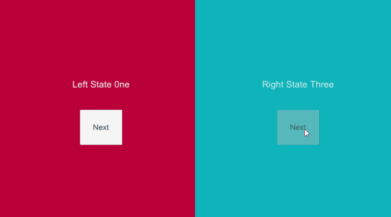

# Unity3D - RxStateMachine



State machine makes managing states easy, it is widely used on games and apps.
However, there are not many state machines that designed with front-end in mind.

Often, integrating multiple states with UI transition can be a huge hassle and needs extra code to make simple transitions working with states.
RxStateMachine is desgined with "front end first" and "Reactive" in mind.

RxStatemachine is built upon[ thefuntastic's finite state machine](https://github.com/thefuntastic/Unity3d-Finite-State-Machine).<br/>
Basic structure is mostly same but the core logic is implemented with [Unirx](https://github.com/neuecc/UniRx) (Reactive Extension for Unity)
**[Download Unirx](https://assetstore.unity.com/packages/tools/unirx-reactive-extensions-for-unity-17276) first to use RxStateMachine.**

Thanks to [thefuntastic](https://github.com/thefuntastic) and [neuecc](https://github.com/neuecc) for amazing statemachine and unirx!

## Features

#### 3 Transition Modes
* Safe
* OverWrite
* Blend
#### Flexible
* Support multiple statemachine instances
* Support Transition as routine or single call
#### Responsive and Resilent
* Notifies transition progress
* State Transition can be canceled
* no co-routine used, more reliable functionality

## Basic Usage

An example project is included (Unity 2017.3) to show the State Machine in action.

### Single Script Setup
To use the state machine you need a few simple steps

##### 1. Include the RxStateMachine package

```C#
using Bebimbop.Utilities.StateMachine;

public class MyStateMachineClass : MonoBehaviour { }
```

##### 2. Define your states using an Enum 

```C#
public enum State
{
    Init, 
    Play
}
```
##### 3. Create a variable to store a reference to the State Machine 

```C#
public StateMachine<State> MyStateMachine;
```

##### 4. Get a valid state machine for your MonoBehaviour

```C#
MyStateMachine = StateMachine<States>.Initialize(this);
```

This is where all of the magic in the StateMachine happens: in the background it inspects your MonoBehaviour (`this`) and looks for any methods described by the convention shown below.

You can call this at any time, but generally `Awake()` is a safe choice. 

##### 5. You are now ready to manage state by simply calling `ChangeState()`
```C#
MyStateMachine.ChangeState(States.Init);
```

##### 6. State callbacks are defined by underscore convention ( `StateName_Method` )

```C#
//for single frame transition
private void One_Enter()
{
  Debug.Log("State One Entered");
}

//for transiton over time
//float t is between 0 ~ 1 (Start ~ end)
private void Two_Enter(float t)
{
  Debug.Log( "Entering State Two.. Progress "  + t);
}
//output
//Entering State.. Progress 0
//Entering State.. Progress 0.43975
//...
//Entering State.. Progress 0.9476
//Entering State.. Progress 1

//OnCancel Method gets called when transtion interrupted
private void Two_OnCancle()
{
    
}

void Play_Update()
{
	Debug.Log("Game Playing");
}

void Play_Exit()
{
	Debug.Log("Game Over");
}
```
Currently supported methods are:

- `Enter`
- `Exit`
- `FixedUpdate`
- `Update`
- `LateUpdate`


## Exmaples


