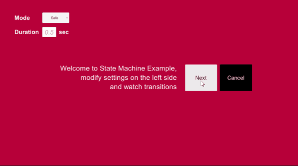
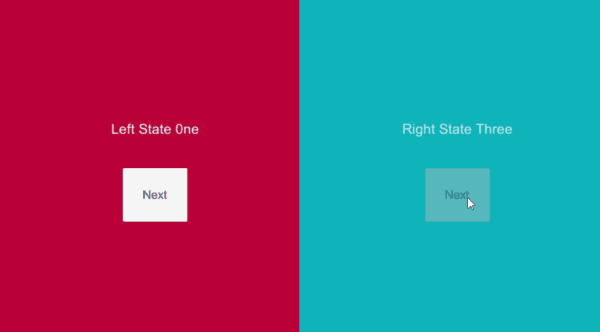
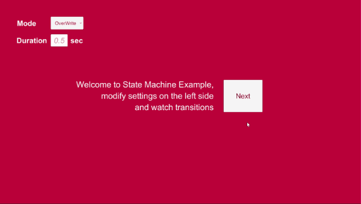
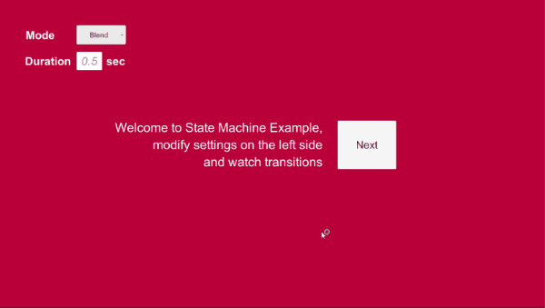

# Unity3D - RxStateMachine


State machine makes managing states easy, it is widely used in many games and apps.
However, there are not many state machines that designed with front-end in mind.

Often, integrating multiple states with UI transition can be a huge hassle and needs extra code to make simple transitions working with states.
RxStateMachine is designed with "front end first" and "Reactive" in mind.

RxStatemachine is built upon[ thefuntastic's finite state machine](https://github.com/thefuntastic/Unity3d-Finite-State-Machine).<br/>
Basic structure is mostly same but the core logic is implemented with [Unirx](https://github.com/neuecc/UniRx) (Reactive Extension for Unity)

Thanks to [thefuntastic](https://github.com/thefuntastic) and [neuecc](https://github.com/neuecc) for amazing statemachine and unirx!

## Features

#### 3 Transition Modes
* Safe
* OverWrite
* Blend
#### Flexible
* Support multiple statemachine instances
* Support Transition as routine or single call
#### Responsive
* Notifies transition progress
* State Transition can be canceled
* no co-routine used, more reliable functionality

## Basic Usage

An example project is included (Unity 2017.3) to show the RxStateMachine in action.
To use the state machine you need a few simple steps

##### 1. Include the RxStateMachine package

```C#
using Bebimbop.Utilities.StateMachine;

public class MyStateMachineClass : MonoBehaviour { }
```

##### 2. Define your states using an Enum 

```C#
public enum States
{
    Init, 
    Play
}
```
##### 3. Create a variable to store a reference to the State Machine 

```C#
public StateMachine<States> MyStateMachine;
```

##### 4. Get a valid state machine for your MonoBehaviour

```C#
MyStateMachine = StateMachine<States>.Initialize(this);
```

This is where all of the magic in the RxStateMachine happens: in the background, it inspects your MonoBehaviour (`this`) and looks for any methods described by the convention shown below.

You can call this at any time, but generally `Awake()` is a safe choice. 

##### 5. You are now ready to manage state by simply calling `ChangeState()`
```C#
MyStateMachine.ChangeState(States.Init);
```

##### 6. State callbacks are defined by underscore convention ( `StateName_Method` )

```C#
//for single frame transition
private void Init_Enter()
{
    Debug.Log("Init done!");
}

//for transiton over time
//float t is between 0 ~ 1 (Start ~ end)
private void Play_Enter(float t)
{
    //Ui transition so easy!
    canvasGroup.alpha = t;
    Debug.Log( "Entering State.. Progress "  + t);
}
/* output
Entering State.. Progress 0
Entering State.. Progress 0.43975
...
Entering State.. Progress 0.9476
Entering State.. Progress 1*/

//OnCancel Method gets called when transtion interrupted 
//by either calling ChangeState() with overwirte or CancelTranstion()
private void Play_OnCancle()
{
    canvasGroup.alpha = 0;
}

void Play_Update()
{
    Debug.Log("Game Playing");
}

void Play_Exit()
{
    Debug.Log("Game Over");
}
```
Currently supported methods are:

- `Enter`
- `EnterCancel`
- `Exit`
- `ExitCancel`
- `Finally`
- `FixedUpdate`
- `Update`
- `LateUpdate`

These methods can be private or public. The methods themselves are all optional, so you only need to provide the ones you actually intend on using. 

Enter/Exit routines are supported by simply adding `float` parameter into Enter/Exit methods. This can be a great way to accommodate animations. Note: `FixedUpdate`, `Update` and `LateUpdate` calls won't execute while an Enter or Exit routine is running.

`Finally` is a special method guaranteed to be called after a state has exited. This is a good place to perform any hygiene operations such as resetting Uis or removing event listeners. 

##### Setting Transition defaults and Cancel Transition
There is simple support for managing asynchronous state changes with long enter or long exit.
```C#
MyStateMachine.SetDuration(enterDuration = 0.5f, exitDuration = 0.5f)
```
The default duration for enter/exit is 0.5f but you can set it to any value as you need. by calling this method will set **all transition** to set duration. 

```C#
MyStateMachine.SetMode(transition = StateTransition.Safe);
```
The default is `StateTransition.Safe`. This will always allow the current state to finish both it's enter and exit functions before transitioning to any new states. by calling this method will set **all transition** to set mode.

```C#
MyStateMachine.SetMode(transition = StateTransition.Overwrite);
```
`StateMahcine.Overwrite` will cancel any current transitions and invoke `Cancel` methods (*more detail explained in advance usage section*), and call the next state immediately. This means any code which has yet to run in enter and exit routines will be skipped. If you need to ensure you end with a particular configuration, the finally function will always be called:

```C#
void MyCurrentState_Finally()
{
    //Reset object to desired configuration
}
```

```C#
MyStateMachine.SetMode(transition = StateTransition.Blend);
```
`StateMahcine.Blend` this will call/run the current state `Exit` routine and the next state `Enter` routine at the same time. this is useful when you need crossfade transition.


```C#
MyStateMachine.CancelTransition();
```
All transitions can be canceled by calling this method, and it will invoke the current `EnterCancel` or `ExitCancel` or both depends on how far you in the transition. 

*e.g) if you call `CancleTransition()` beginning of exit routine, it will invoke `ExitCancel`. if you call it after entering to new state's Enter routine, it will invoke both current state's `ExitCancel` and new state's `EnterCancel` methods.*

##### Dependencies

UniRx, Reactive extension for Unity. latest source code(as of 02/13/18) already included in this repository, 
but if you want to get a newer vision, **[Download Unirx](https://assetstore.unity.com/packages/tools/unirx-reactive-extensions-for-unity-17276)**


## Advanced Usage

#### Multiple Script Setup
To use RxStateMachine over multiple scripts is also simple.
Here's basic example how to setup RxStateMachine in multiple scripts

##### 1. Declare StateMachine in the desired script
in this example, we declare StateMachine in *GameManager.cs* and make GameManager as a singleton to call it from other scripts

```C#
<GameManager.cs>
    public class GameManager : MonoBehaviour
    {
        public StateMachine<State> MainStateMachine;
        private void Awake()
        {
            //initialize statemachine in Awake() to avoid Null error in other scripts
            MainStateMachine = StateMachine<State>.Initialize(this);
        }
        
        //define state
        public enum State
        {
            RED = 0,BLUE
        }

      //some singleton behaviour
      private static GameManager instance = null;

        public static GameManager Instance { ... }
    }
```

##### 2. Add State Script Component to subscribe state changes with callbacks 

```C#
<RedState.cs>
    public class RedState : MonoBehaviour
    {
        private StateMachine<State> _mainStateMachine;
        private void Start()
        {
            _mainStateMachine = GameManger.MainStateMachine;
            //add RedState as subscriber to mainStateMachine.
            _mainStateMachine.AddSubscriber(this);
        }
        
        //call backs
        private void RED_Enter(float t) { }
        private void RED_Exit(float t) { }
    }
    
<BlueState.cs>    
    public class BlueState : MonoBehaviour
    {
        private StateMachine<State> _mainStateMachine;
        private void Start()
        {
            _mainStateMachine = GameManger.MainStateMachine;
            //add BlueState as subscriber to mainStateMachine.
            _mainStateMachine.AddSubscriber(this);
        }
        
        //call backs
        private void BLUE_Enter(float t) { }
        private void BLUE_Exit(float t) { }
    }
```

#### Manual Transition
[TODO] add description with examples...
* ChangeState(T newState)
* ChangeState(T newState, StateTransition transition)
* ChangeState(T newState, StateTransition transition, float enterDuration, float exitDuration)

### Cancel Invocation Order & Usage
[TODO] add a description with examples...
* Cancel in Safe Mode
* Cancel in OverWrite Mode
* Cancel in Blend Mode
 
#### [TODO] Example Usage

## Exmaples
#### Multiple StateMachine Example
RxStateMachine support multiple instances of StateMachine.

Example Located `Assests/DemoScenes/MultipleStateMachineExample.unity`

#### StateMachine Example
This example demonstrates most functionalities on RxStateMachine
Change Settings on the left side and see the difference between 3 transition modes and Test cancellation to see how it works in different modes

Example Located `Assests/DemoScenes/StateMachineExample.unity`
##### Safe Mode

##### OverWrite Mode

##### Blend Mode

