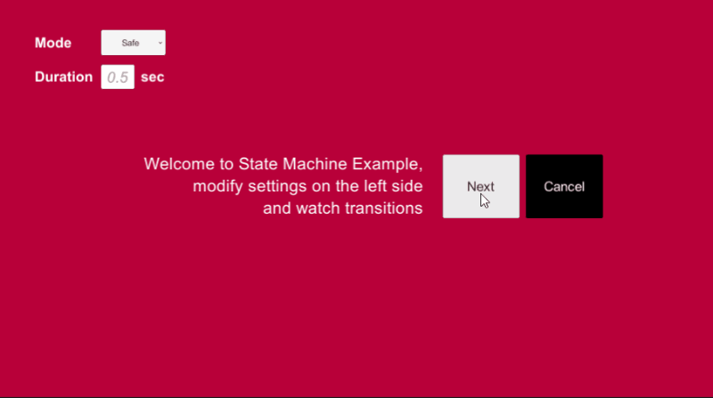

# Unity3D - RxStateMachine


RxSateMachine v2.0 is out! It is more simpler and easy to use! for old version look in to [Old](https://github.com/sendtogil/RxStateMachine/tree/master/Old) folder.

State machine makes managing states easy, it is widely used in many games and apps.
However, there are not many state machines that designed with front-end in mind.

Often, integrating multiple states with UI transition can be a huge hassle and needs extra code to make simple transitions working with states.
RxStateMachine is designed with "front end first" and "Reactive" in mind.

Thanks to [neuecc](https://github.com/neuecc) for Reactive Extensions for Unity(unirx)!

##### Dependencies

Unity +2018.2, UniRx, Reactive extension for Unity. latest source code(as of 02/13/18) already included in this repository, 
but if you want to get a newer vision, **[Download Unirx](https://assetstore.unity.com/packages/tools/unirx-reactive-extensions-for-unity-17276)**

## Features

#### 2 Transition Modes
* Regular
    * (ST1)Enter -> (ST1)Exit -> (ST2)Enter -> 
* Blend
    * (ST1)Enter -> (ST1,ST2)Exit,Enter -> (ST2,ST3)Exit,Enter ->

#### Flexible
* Subscribe OnEnter/Exit of State or just Sate changes 
* Expend OnEnter/Exit behaviour as you wanted
* Support multiple state machine instances

#### Responsive
* State Transition can be canceled
* no co-routine used, more reliable functionality

## Simple Usage (State change pub/sub)
To use the state machine you need a few simple steps

##### 1. Include the RxStateMachine package

```C#
using using _Scripts.RxDevKit.StateMachine;

```

##### 2. Define your states using an Enum 

```C#
public enum MyState
{
    Init,State01,State02,State03
}
```
##### 3. Create a variable to store a reference to the State Machine 

```C#
private StateMachine<MyState> _stateMachine;
```

##### 4. You are now ready to change(publish) state by simply calling `ChangeState()`
```C#
_stateMachine.ChangeState(MyState.Init);
```

##### 5. Subscribe StateChanges!
```C#
    var mainCam = Camera.main;
	_stateMachine.Subscribe(state =>
			{
				Debug.Log($"you are in {state}");
				switch (state)
				{
					case MyState.State01:
						mainCam.backgroundColor = Color.gray;
						break;
					case MyState.State02:
						mainCam.backgroundColor = Color.magenta;
						break;
					case MyState.State03:
						mainCam.backgroundColor = Color.white;
						break;
					default:
						mainCam.backgroundColor = Color.black;
						break;
				}
			});
```
## Basic Usage (OnEnter/OnExit Async Subscription)
with Rx SateMachine, you can subscribe Sate's Enter and Exit.
There are some points you need to pay attention to avoid confusion.
1. On Enter, On Exit only accepts `Func<IObservable<Unit>>` data type.
```C#
_stateMachine.OnEnter(MyState.Init, () =>Observable.Timer(TimeSpan.FromSeconds(2f)).AsUnitObservable());
```
2. you can subscribe this OnEnter/OnExit stream as many as you can.
3. However, OnEnter/OnExit transition will be completed when the last(longest) steam is complete.
4. Which means, you can subscribe many OnEnter/OnExit on a State to handle different things.

* below example using [RxFadeManager](https://github.com/sendtogil/RxFadeManager) to fade in and out on State changes.
```C#
namespace Demo.StateMachine
{
	public class Demo2State : MonoBehaviour
	{
		public CanvasGroup Panel;
		public MyState ThisState;
		private StateMachine<MyState> _stateMachine;
	
		void Start ()
		{
			_stateMachine = Demo02Manager.Instance.StateMachine;
			var duration = Demo02Manager.Instance.FadeDuration;
			Panel.DisableCanvasGroup(true);
			
			_stateMachine.OnEnter(ThisState, () => Panel.FadeIn(duration).AsUnitObservable());
			_stateMachine.OnExit(ThisState, () => Panel.FadeOut(duration).AsUnitObservable());
		
			if(ThisState == MyState.Init) _stateMachine.ChangeState(MyState.Init);
		}
	}
}

```

## Advanced Usage
#### Multiple Script Setup
To use RxStateMachine over multiple scripts is also simple.
Here's basic example how to setup RxStateMachine in multiple scripts


##### 1. Declare StateMachine in the desired script
in this example, we declare StateMachine in *GameManager.cs* and make GameManager as a singleton to call it from other scripts

```C#
<GameManager.cs>
    public class GameManager : MonoBehaviour
    {
      
    }
```

##### 2. Add State Script Component to subscribe state changes with callbacks 

```C#
<RedState.cs>
    public class RedState : MonoBehaviour
    {
       
    }
    
<BlueState.cs>    
    public class BlueState : MonoBehaviour
    {
       
    }
```

#### Manual Transition
[TODO] add description with examples...

### Cancel Invocation Order & Usage
[TODO] add a description with examples...
 
#### [TODO] Example Usage

## Exmaples
#### Multiple StateMachine Example
#### StateMachine Example
