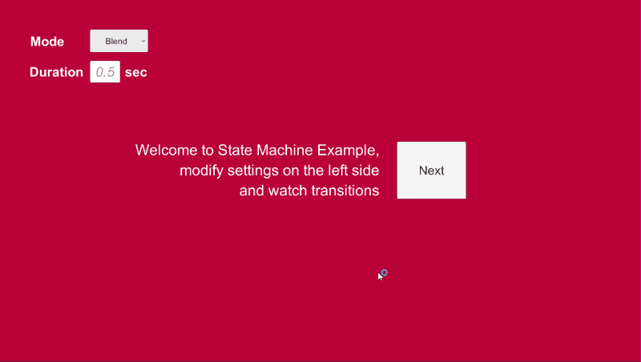

# Unity3D - RxStateMachine

State machine makes managing states easy, it is widely used on games and apps.
However, there are not many state machines that designed with front-end in mind.

Often, integrating multiple states with UI transition can be a huge hassle and needs extra code to make simple transitions working with states.
RxStateMachine is desgined with "front end first" and "Reactive" in mind.

RxStatemachine is built upon[ thefuntastic's finite state machine](https://github.com/thefuntastic/Unity3d-Finite-State-Machine). 
Basic structure is mostly same but the core logic is implemented with [Unirx](https://github.com/neuecc/UniRx) (Reactive Extension for Unity)
**[Download Unirx](https://assetstore.unity.com/packages/tools/unirx-reactive-extensions-for-unity-17276) first to use RxStateMachine.**

Thanks to [thefuntastic](https://github.com/thefuntastic) and [neuecc](https://github.com/neuecc) for amazing statemachine and unirx!

## Features

* 3 Transition Modes
    * Safe Mode 

    * OverWrite Mode

    * Blend Mode

* Flexible
* Responsive and Resilent

## Usage
* dependancy : Unirx

## Exmaples

